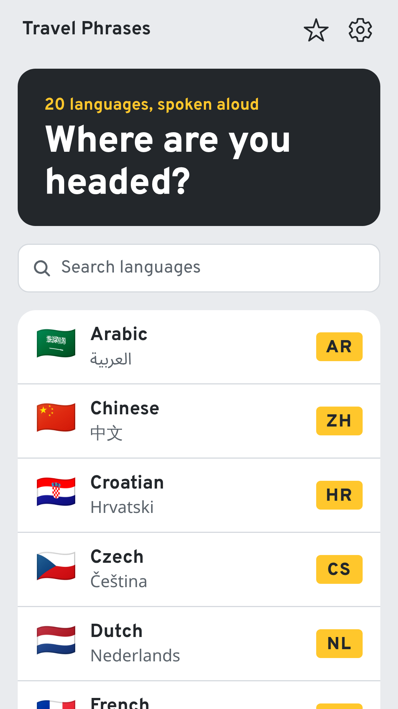
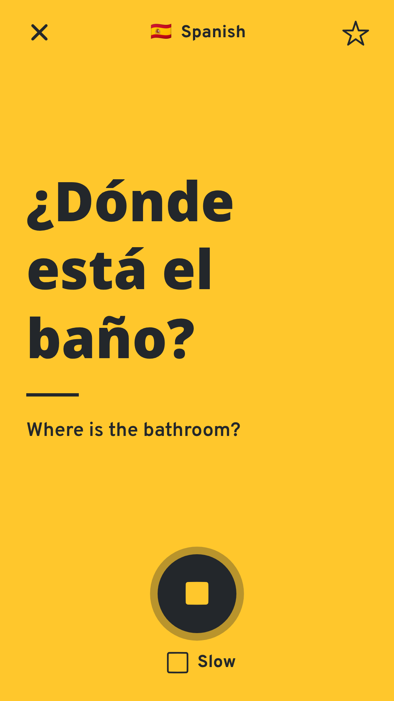
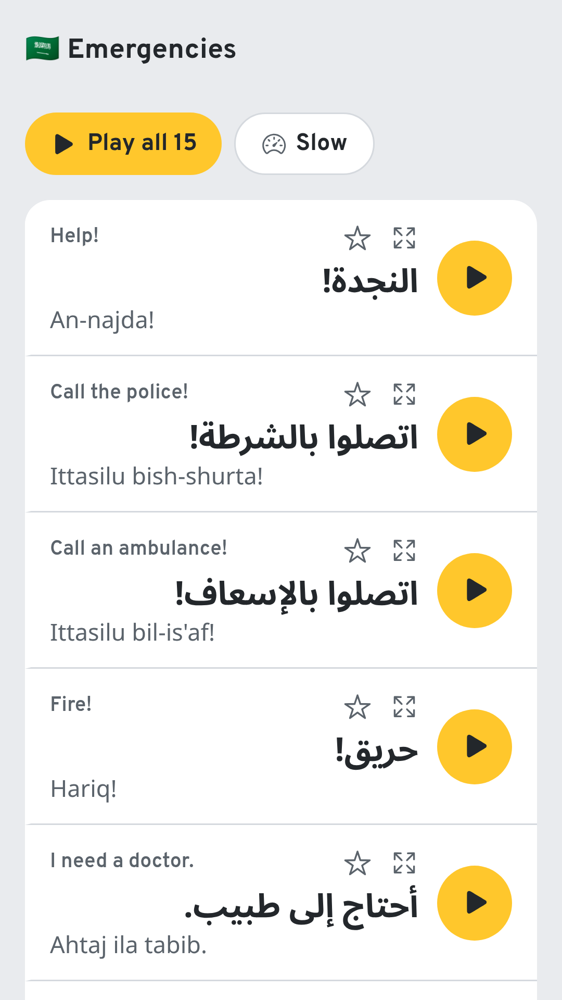

# Travel Phrases

Travel Phrases is a phrasebook app for travelers. It has 177 common phrases in 20 languages, grouped by situation, and it plays each phrase aloud. It is built with Expo (React Native) and runs on Android, iOS and the web.

<p align="center">
  
  
  
  
</p>

## Generative AI

This project was built with the help of generative AI. AI tools wrote most of the code and documentation and translated the phrases. The app icon and the phrase audio (OpenAI text-to-speech) are AI-generated too. Native speakers haven't reviewed the translations or the audio yet.

## What's in the app

Pick a language, open a category and tap a phrase to hear it. Play all reads out a whole category, and Slow plays the audio at 70% speed. Show mode fills the screen with one phrase in large type, so you can hand your phone to someone and let them read it.

Phrases in Arabic, Chinese, Greek, Hindi, Japanese, Korean, Russian and Thai have a pronunciation guide in Latin letters. Some phrases change with the speaker's gender (in Portuguese a man says obrigado and a woman says obrigada), and a setting picks which form to show and play. You can save phrases, and search in English or in the target language.

Categories: basics, conversation, emergencies, directions, transport, accommodation, food and drink, shopping and money, health, sightseeing, numbers, and time and days.

Languages: Arabic, Chinese (Mandarin), Croatian, Czech, Dutch, French, German, Greek, Hindi, Indonesian, Italian, Japanese, Korean, Polish, Portuguese (Brazil), Russian, Spanish, Thai, Turkish and Vietnamese.

## Download

For Android, download the APK from [Releases](https://github.com/lucas-pospor/travel-phrases/releases). It runs on Android 7.0 or later, and the release notes explain how to install it. There is no iPhone version yet.

## Running it

```bash
npm install
npm start
```

Scan the QR code with Expo Go ([Android](https://play.google.com/store/apps/details?id=host.exp.exponent), [iOS](https://apps.apple.com/app/expo-go/id982107779)) on a phone that is on the same Wi-Fi network as your computer. Press `w` to open the web version instead.

## Audio

Each phrase has an MP3 clip bundled with the app, so audio works offline. If a clip is missing, the app falls back to the phone's built-in text-to-speech voice.

The clips were made with OpenAI text-to-speech (model `gpt-4o-mini-tts`, voice `marin`), with instructions to use a native accent for each language. They are AI-generated, not recordings of real people. OpenAI's usage policies require telling users this. The app says so in Settings and under every phrase list, so keep that text if you change the interface.

To regenerate the clips, copy `.env.example` to `.env` and add an OpenAI API key. The script can use Google Cloud Text-to-Speech instead if you set `GOOGLE_TTS_API_KEY` and leave the OpenAI key empty. Keys stay on your machine and never go into the app bundle.

```bash
npm run audio -- --dry-run                  # show what would be generated, no API calls
npm run audio                               # generate missing or changed clips
npm run audio:check                         # transcribe every clip and flag mismatches
npm run audio:check -- --flagged --delete   # delete the flagged clips,
npm run audio                               # regenerate them,
npm run audio:check -- --flagged            # and check them again
```

`npm run audio` also accepts `--langs ja,ko`, `--only basics.` (a phrase id prefix), `--gender male`, `--force` and `--provider google`.

A full run with OpenAI makes about 3,700 clips and costs around $2. Checking every clip costs about $0.40 more. The script only synthesizes phrases whose text, voice or settings have changed. If ffmpeg is installed, it trims silence from each clip and re-encodes it as a mono 48 kbps MP3, which keeps the whole set at about 38 MB.

`audio:check` sends each clip to OpenAI speech-to-text and compares the transcript with the phrase. It catches empty clips, garbled audio and clips in the wrong language. It can't hear a foreign accent on a correctly pronounced word, and it often trips on one-syllable words, so it doesn't replace listening. Results go to `assets/audio/check-report.json`, which is not committed.

In the last full check, 99.2% of clips matched. Most of the rest are Japanese words that came back in kanji instead of kana. The clips that failed every check and still need someone to listen to them are the Korean numbers 3, 4, 7, 8 and 100, and the French numbers 1, 5, 8 and 20. Chinese, Thai and Vietnamese deserve a spot check by ear too, because a wrong tone changes the word.

## Phrase data

- `src/data/phrases.ts` has the English master list and the categories.
- `src/data/languages.ts` has language metadata: voice locales, script and text direction.
- `src/data/translations/<code>.json` holds one language, keyed by phrase id. The entry format is described at the top of `scripts/validate-data.ts`.

```bash
npm run validate   # every language has every phrase, with romanization where needed
npm run check      # validate, typecheck and lint
```

To add a phrase, add it to `PHRASES`, add its translation to every language file, run `npm run validate`, then run `npm run audio`.

## Translations

The translations were machine-generated, and native speakers haven't reviewed them yet. Treat them as a draft, especially anything about allergies or medication.

## Privacy

The app collects no data and works offline. See the [privacy policy](https://lucas-pospor.github.io/travel-phrases/privacy.html).

## Releases and store listings

Version numbers live in `app.json`. `version` is the one users see, and `android.versionCode` and `ios.buildNumber` must go up by one with every release. Commit the change before building, because EAS builds only committed files.

```bash
npx eas-cli@latest build -p android --profile apk          # installable APK for GitHub releases
npx eas-cli@latest build -p android --profile production   # AAB for Google Play
npx eas-cli@latest build -p ios --profile production       # build for the App Store
```

The store listings are in the repo:

- `fastlane/metadata/android/en-US/` has the Google Play listing: title, descriptions, changelogs, icon, feature graphic and phone screenshots. F-Droid and IzzyOnDroid read this folder directly.
- `store.config.json` has the App Store listing. Upload it with `npx eas-cli@latest metadata:push`.
- `fastlane/screenshots/en-US/` has the App Store screenshots for 6.9-inch iPhones.
- `docs/` is the project website on GitHub Pages, including the privacy policy that both stores ask for.

The screenshots were captured from the web version of the app in a headless browser.

## Project layout

```
src/app/                 screens (Expo Router)
  index.tsx              language list
  [lang]/index.tsx       categories and phrase search for one language
  [lang]/[category].tsx  phrase list with Play all
  show.tsx               full-screen Show mode
  favorites.tsx          saved phrases
  settings.tsx           settings
src/audio/               playback, and the generated audio index
src/components/          shared UI components
src/data/                phrases, languages, translations
src/state/               settings and saved phrases (persisted), playback state
assets/audio/            generated clips and their manifest
docs/                    project website and privacy policy (GitHub Pages)
fastlane/                store listing text, icon, feature graphic and screenshots
store.config.json        App Store listing (EAS Metadata)
eas.json                 EAS build profiles
scripts/                 validate-data.ts, generate-audio.ts, check-audio.ts (Node 22.18 or later)
```

## License

Copyright (C) 2026 Lucas Pospor

Travel Phrases is free software, licensed under the GNU General Public License, version 3 or (at your option) any later version. See [LICENSE](LICENSE). Commercial use is allowed. If you distribute the app or a modified version of it, you must make the source code available under the same license.

Bundled third-party components keep their own licenses. The Overpass font is under the SIL Open Font License 1.1, and Ionicons is under the MIT License.
